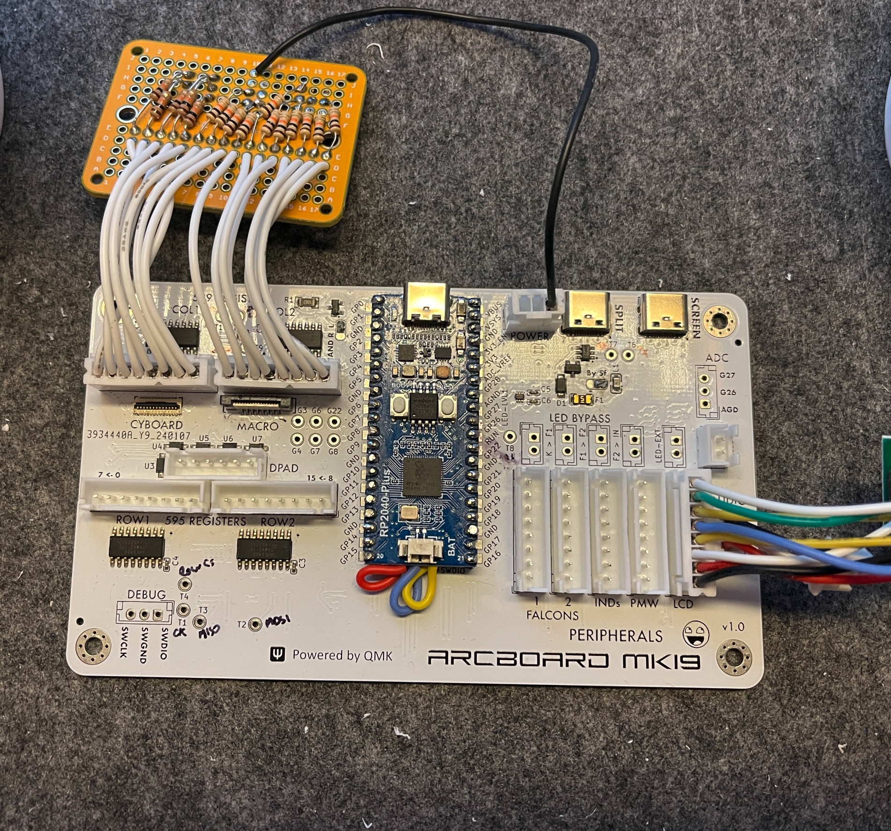

# PRODUCTION UPDATE - SUPERSEDED
This has been superseded by the rev2 of this board: [mk19](https://github.com/christrotter/mk19-pcb)

Many lessons learned.  Chief among them - it works!  We were able to prove out the shift register method.

## Things to fix
- dpad col usage; rethink how to make the dpad customizable e.g. rkjxt change-of-mind
- bad tft pinout; ordering wrong
- tft should be 0.5mm 8-pin ffc, not jst
- missing resistor arrays, 10k
- if there is a pin that could be reconfigured, ensure there is a breakout for that?
- move cyboard to edge of board
- cyboard breakout pcbs...seriously consider this; the cable lengths are super short
- main to a larger ffc cable
- per-key 0.3mm extenders pcbs...?
- change macropad vertical to edge-of-board flat FFC
- 90-deg jst, how will this help?
- and how would we make it fit?  where would things work out best to avoid the pcb capture?
- really need to make this happen
- bigger solder pads; or rather, jumpers! for the handedness, power bypass
- re-think the led bypass stuff...
- the whole bypass thing doesn’t work like i’d thought
- spare gpio breakouts should be 2.54 spaced
- what would it look like to have dual TFT?
- indicator breakout
- really needs to be DI/DO pairs per block of LEDs
- main slats
- small slats
- indicators
- then dedicated power breakouts for each
- 5v/3.3v/gnd for debug
- 5v/gnd x3 for leds
- there’s something i thought of that i didn’t write down and here we are…
- need to provide for power input
- GeorgeN suggests VSYS, not VBUS
- section 4.5 of pico datasheet
- do we want a dedicated USB power in?

# mk18-pcb
The antithesis of 'keep it simple, stupid' - all the features, all the time.

Do you need to use the Cyboard flex-pcb system?  Multiple Falcon pcbs?  SPI devices?  32 pins for rows/cols?  Perhaps enough RGB to illumine your entire home?  Audio?  ADC?  Reset switch? Power and debug breakouts?  And use an existing RP Pico to do it?

Probably not, which is why I had to design my own pcb.  So here it is...

# design goals
- Provide a re-usable platform for the arcboards that includes all of the normal functions
- Make it possible to use the Cyboard flex-pcb system
- Minimize pin usage by moving cols/rows over to shift registers
- Reduce the amount of fiddly soldering and wire stripping a normal hand-wire requires of you
- usb-c interconnects

## feature details

- Raspberry PI Pico (RP2040) footprint - just add pin headers and solder away - or, solder right to pads
- keys provided through the Cyboard flex-pcb: https://www.cyboard.digital/product-page/dactyl-flex-pcbs
 - or, JST-XH 2.54 headers
- macropad using Cyboard flex-pcb keys, custom breakout pcb: https://github.com/christrotter/macropad-pcb (0.5mm pitch 16-pin FFC cable)
 - vertical FFC connector
- dpad using custom breakout pcb: https://github.com/christrotter/5way-pcb
 - diodes are configured for ROW2COL
- usb-c split connector w. tzarc-grade voltage protection
 - buuut included a solder pad jumper to bypass if needed
- split-handedness pin
- SPI breakouts
  - PMW33xx
  - LCD (e.g. GC9A01)
  - shift registers (595 for rows, 589 for cols)
- pin breakouts
 - power, debug, ADC, audio, reset
 - remaining GPIO pins
 - test points (SPI pins, serial pins, WS2818 before/after level shifting)
- led breakouts w. bypasses
 - keys
 - 2x falcon pcbs
 - indicator strip
 - screen-mounted external indicators via usb-c
 - pin for whatever else you want to add to the chain

## pcb features
- two-layer pcb w. dual ground planes tied w. vias
- components configured as per datasheets
- bypass capacitors!
- care taken to avoid power running alongside signal for too long

# schematic overview
## mcu

## keys

## peripherals

## usb connections

## breakouts

